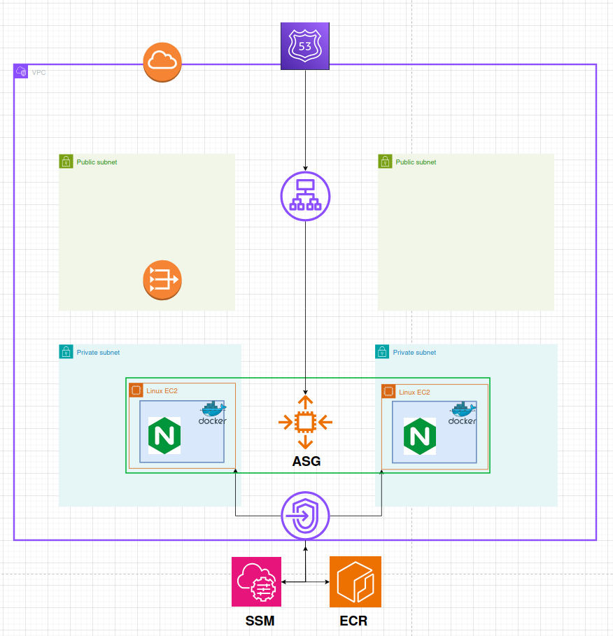
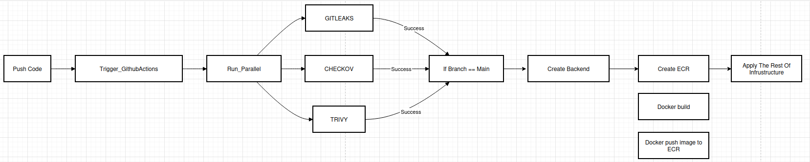
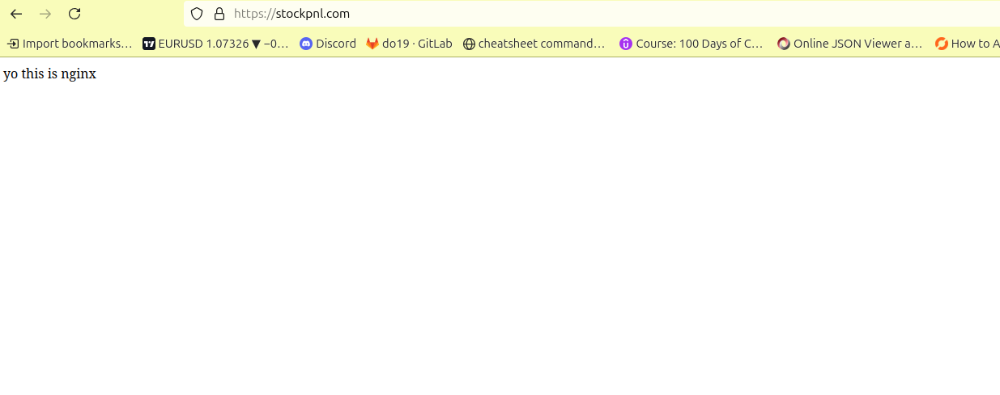

# Nginx-yo

This project demonstrates a complete, secure, and production-grade deployment pipeline for running a Dockerized Nginx app on private EC2 instances inside an Auto Scaling Group (ASG), behind a public HTTPS Load Balancer, with infrastructure provisioned using Terraform and deployed through GitHub Actions CI/CD.

It is designed with best practices for security, modularity, and automation.

## What This Project Includes

- Dockerized NGINX app that returns:  
  "yo this is nginx"
- Deployed in private subnets via Auto Scaling Group
- Docker image pulled securely from Amazon ECR
- EC2 instances accessed only through SSM (no public IPs)
- Public HTTPS ALB for routing traffic to private EC2s
- Route 53 DNS record pointing to the ALB
- VPC Endpoints for ECR and SSM (no need for NAT Gateway for these services)
- CI/CD pipeline using GitHub Actions
  - Gitleaks
  - Checkov
  - Trivy

## Technologies Used

- Terraform – Infrastructure as Code (modular and reusable)
- AWS Services – VPC, EC2, ASG, ALB, Route 53, ACM, ECR, SSM, VPC Endpoints
- Docker – For containerizing NGINX
- GitHub Actions – CI/CD workflows
- Security Tools – Checkov, Trivy, Gitleaks

## Architecture Overview



### Key Components

- VPC with public and private subnets across multiple AZs
- Private EC2 instances created through Auto Scaling Group and Launch Template
- Dockerized Nginx running in each EC2 instance
- Public HTTPS ALB forwarding traffic to ASG target group
- Route 53 DNS configured to point to the ALB
- Amazon ECR to store and serve Docker images
- SSM + VPC Endpoints to manage EC2 securely without a bastion host or public IP

HTTPS is terminated at the ALB. The Dockerized Nginx runs on HTTP inside private subnets.

## GitHub Actions Pipeline



### CI/CD Process

1. Push code to `dev`
2. Open a pull request to `main`
3. Run Gitleaks, Checkov, and Trivy in parallel
4. If all security scans pass and the branch is `main`:
   - Create S3 backend
   - Apply Terraform with `-target=module.ecr` to create ECR
   - Build and push Docker image to ECR
   - Apply the rest of the infrastructure using Terraform
5. Reports are uploaded as GitHub Action artifacts

### Security Scans (Run in Parallel)

- Gitleaks – Scan Git history for hardcoded secrets
- Checkov – Static analysis of Terraform for misconfigurations
- Trivy – Scan Dockerfile and image for vulnerabilities

Note: Security scans are non-blocking in this demo. In production, they would prevent deployment on failure.

## Branch Strategy

- `dev`: Active development happens here
- `main`: Protected branch that only receives code via pull requests

This ensures that all code is reviewed, scanned, and validated before deployment.

## Project Structure

```
.
├── Architecture.png
├── docker
│   └── Dockerfile
├── GitHub_Actions.png
├── image.png
├── README.md
├── s3_state
│   └── main.tf
└── tf
    ├── backend.tf
    ├── data.tf
    ├── main.tf
    ├── modules
    │   ├── alb
    │   │   ├── main.tf
    │   │   ├── outputs.tf
    │   │   └── vars.tf
    │   ├── asg
    │   │   ├── install.sh
    │   │   ├── main.tf
    │   │   ├── outputs.tf
    │   │   └── vars.tf
    │   ├── ec2
    │   │   ├── install.sh
    │   │   ├── main.tf
    │   │   ├── outputs.tf
    │   │   └── vars.tf
    │   ├── ecr
    │   │   ├── main.tf
    │   │   ├── outputs.tf
    │   │   └── vars.tf
    │   ├── iam
    │   │   ├── main.tf
    │   │   ├── outputs.tf
    │   │   └── vars.tf
    │   ├── route53
    │   │   ├── main.tf
    │   │   ├── outputs.tf
    │   │   └── vars.tf
    │   ├── vpc
    │   │   ├── main.tf
    │   │   ├── outputs.tf
    │   │   └── vars.tf
    │   └── vpc_endpoints
    │       ├── main.tf
    │       ├── outputs.tf
    │       └── vars.tf
    ├── outputs.tf
    ├── upload-tfvars.sh
    └── vars.tf
```

## Setup and Deployment

### 1. Clone the Repository
```
git clone https://github.com/omerrevach/yo-nginx.git
cd yo-nginx
```

### 2. Define Infrastructure Variables
Inside the tf directory, create a file named terraform.tfvars with your configuration:

```
# VPC settings
vpc_name           = "nginx-vpc"
cidr               = "10.0.0.0/16"
azs                = ["eu-north-1a", "eu-north-1b"]
public_subnets     = ["10.0.1.0/24", "10.0.2.0/24"]
private_subnets    = ["10.0.11.0/24", "10.0.12.0/24"]
enable_nat_gateway         = true
single_nat_gateway         = true
one_nat_gateway_per_az     = false
environment                = "dev"

# EC2 settings
linux_ami           = "ami-054ba1cb82f26097d"
instance_type       = "t3.micro"

# Route 53
hosted_zone_id = "your_hosted_zone_id"
domain_name    = "your.domain.com"

# Region
region = "eu-north-1"

```

### 3. Set Up GitHub Secrets
In your GitHub repository, go to:
- Settings > Secrets and variables > Actions > New repository secret

Add:
- AWS_ACCESS_KEY_ID
- AWS_SECRET_ACCESS_KEY
- AWS_REGION
- AWS_ACCOUNT_ID

And these TF_VAR_* variables matching your terraform.tfvars file:
* TF_VAR_vpc_name
* TF_VAR_cidr
* TF_VAR_azs
* TF_VAR_public_subnets
* TF_VAR_private_subnets
* TF_VAR_enable_nat_gateway
* TF_VAR_single_nat_gateway
* TF_VAR_one_nat_gateway_per_az
* TF_VAR_environment
* TF_VAR_linux_ami
* TF_VAR_instance_type
* TF_VAR_hosted_zone_id
* TF_VAR_domain_name

### 4. Upload Terraform Variables to GitHub via CLI (More automated)

If you prefer to automate secret creation:
```
chmod +x tf/upload-tfvars.sh
./tf/upload-tfvars.sh
```
This will upload each terraform.tfvars entry as a GitHub secret.

### 5. Destroy Infrastructure
GitHub Actions:

Use the Terraform Destroy workflow manually from the GitHub Actions tab.

### Final Result

A secure, modular, production-ready infrastructure that deploys Dockerized apps on AWS using:
- Private Auto Scaling Group
- HTTPS Load Balancer
- Secure GitHub Actions CI/CD pipeline
- Infrastructure-as-Code best practices with Terraform

