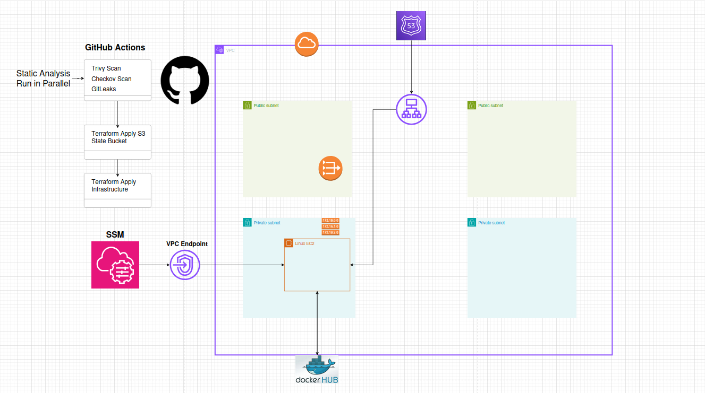

# Nginx yo

## Overview

This project showcases a **fully automated and secure deployment pipeline** that launches a Dockerized NGINX server on a private EC2 instance inside a VPC. The application is publicly accessible via a Load Balancer and responds with:

yo this is nginx


Everything is deployed using **Terraform**, **GitHub Actions**, and follows best practices for **security**, **IaC**, and **CI/CD**

## Technologies Used

- **Terraform** – Infrastructure as Code (modular and clean)
- **AWS** – VPC, EC2, ALB, Route53, VPC Endpoints, SSM
- **Docker** – Containerized NGINX app
- **GitHub Actions** – CI/CD with security scanning
- **Checkov**, **Trivy**, **Gitleaks** – Security tools


## Infrastructure Architecture

- **Private EC2 instance** running Docker
- **Dockerized NGINX** returning "yo this is nginx"
- **Public ALB** for external access
- **Route53** DNS pointing to ALB
- **SSM & VPC Endpoints** for secure EC2 management (no public IPs)
- **Terraform modules** for VPC, EC2, ALB, IAM, Route53, and Endpoints


## Architecture Diagram




## GitHub Actions Pipeline

### The CI/CD pipeline is **fast, secure, and well-organized**:

### Security Checks (Run in Parallel):
- **Gitleaks**: Scan for secrets in Git history
- **Trivy**: Scan Dockerfile for vulnerabilities
- **Checkov**: Scan Terraform for misconfigurations

> All scans allow the pipeline to continue even if issues are found, in prod i would never do this. This is a demo so it will just run

### Terraform (Main Branch Only):
Runs **only after all security checks pass**, and **only on `main` branch** (via PR from `dev`):

- `terraform fmt -check -recursive`
- `terraform init`
- `terraform validate`
- `terraform apply`

### Artifacts and Reports:
Each security and infrastructure check generates a detailed report. These reports are saved as GitHub Actions artifacts, allowing you to download and review scan results such as:

    Detected vulnerabilities

    Secret exposures

    Misconfigured Terraform resources

This makes it easy for developers and reviewers to track issues, understand security risks, and maintain infrastructure blocking the deployment process


## Branch Strategy

- `dev`: Active development
- `main`: Protected, only receives **Pull Requests** from `dev`

This ensures that **only reviewed and scanned code reaches production**


## Setup and Deployment
1. **Clone the Repo**
    ```
    git clone https://github.com/omerrevach/yo-nginx.git
    cd to-nginx
    ```

2. **Set Up GitHub Secrets**

    To allow GitHub Actions to deploy infrastructure, go to your repo -> Settings-> Secrets and variables-> Actions and add these secrets:

        AWS_ACCESS_KEY_ID

        AWS_SECRET_ACCESS_KEY

        AWS_REGION (example: eu-north-1)

3. **Define Infrastructure Variables**

In the tf directory, create a file named terraform.tfvars and paste your settings like this:

    
    # VPC settings
    vpc_name           = "nginx-vpc"
    cidr              = "10.0.0.0/16"
    azs               = ["eu-north-1a", "eu-north-1b"]
    public_subnets    = ["10.0.1.0/24", "10.0.2.0/24"]
    private_subnets   = ["10.0.11.0/24", "10.0.12.0/24"]
    enable_nat_gateway         = true
    single_nat_gateway         = true
    one_nat_gateway_per_az     = false
    environment                = "dev"

    # EC2 settings
    linux_ami           = "ami-054ba1cb82f26097d"
    instance_type       = "t3.micro"

    # ALB and ACM
    alb_name_prefix     = "nginx"

    # Route 53
    hosted_zone_id = "your_hosted_zone_id_for_domain_name"
    domain_name    = "example.com"

    region = "eu-north-1"
    

If you don't want to commit this file, you can add these values as GitHub secrets (manually or via a script) and reference them in your Terraform code using var.<name>.

Optional: Use **GitHub CLI** to Upload Secrets

Instead of adding secrets manually in the GitHub UI, you can use the GitHub CLI (gh) to quickly upload all your Terraform variables.

1. **Install GitHub CLI**
    ```
    # macOS:
      brew install gh

    # Ubuntu:
      sudo apt install gh

    # Windows:
      winget install --id GitHub.cli

    Then login:

    gh auth login
    ```
2. **Upload your secrets:**

    - make sure all of values are correct in terraform.tfvars

    ```
    chmod +x upload-tfvars.sh
    ./upload-tfvars.sh
    ```

    - this will store all tf vars one y one in the secrets in GitHub Repo
    

4. **Deployment**

    Once your secrets and terraform.tfvars are set:

    Push your changes to the dev branch

    Open a pull request to main

    If all security scans pass, GitHub Actions will automatically deploy the infrastructure

**You can also deploy manually:**
    
    cd tf
    terraform init
    terraform apply -auto-approve
    

5. **Destroying Resources**

    To tear down everything:

    cd tf
    terraform destroy -auto-approve

    Or use the GitHub Actions workflow called destroy.yml, available in the "Actions" tab.


#